<!DOCTYPE html>
<html lang="en">
  <head>
    <meta charset="UTF-8" />
    <meta name="viewport" content="width=device-width, initial-scale=1.0" />
    <title>PUP Interactive Map</title>
    <link rel="stylesheet" href="style.css" />
    
  </head>

  <body>
  </section>
    

      
      <map name="pup-map">
        <area shape="poly" coords="1041, 565, 1080, 553, 1109, 573, 1066,589, 1041, 565" alt="pylon" href="#" onclick="openPanel(event)" id="pylon" data-tooltip="pylon-tooltip" />
        <area shape="circle" coords="1028, 600, 13" alt="mural" href="#" id="mural" data-tooltip="mural-tooltip" />
        <area shape="circle" coords="1043, 538, 11" alt="visitors" href="#" onclick="openPanel(event)" id="visitors" data-tooltip="visitors-tooltip" />
        <area shape="poly" coords="1024, 503, 1122, 562, 1186, 540, 1082,486,1024,503" alt="open" href="#" onclick="openPanel(event)" id="open" data-tooltip="open-tooltip" />
        <area shape="poly" coords="931,462,992,503,1064,480,987,436,931,462" alt="lawn" href="#" onclick="openPanel(event)" id="lawn" data-tooltip="lawn-tooltip" />
        <area shape="poly" coords="852,405,906,446,962,427,902,392,852,405" alt="basketball" href="#" onclick="openPanel(event)" id="basketball" data-tooltip="basketball-tooltip" />
        <area shape="circle" coords="806, 475, 19" alt="souvenir" href="#" onclick="openPanel(event)" id="souvenir" data-tooltip="souvenir-tooltip" />
        <area shape="poly" coords="714,431,747,469,783,455,738,421,714,431" alt="shrine" href="#" onclick="openPanel(event)" id="shrine" data-tooltip="shrine-tooltip" />
        <area shape="rect" coords="639,418,692,443" alt="museum" href="#" onclick="openPanel(event)" id="museum" data-tooltip="museum-tooltip" />
        <area shape="circle" coords="735,373,42" alt="obelisk" href="#" onclick="openPanel(event)" id="obelisk" data-tooltip="obelisk-tooltip" />
        <area shape="poly" coords="539,417,602,436,647,407,582,391,539,417" alt="freedom" href="#" onclick="openPanel(event)" id="freedom" data-tooltip="freedom-tooltip" />
        <area shape="poly" coords="445,436,430,466,548,460,544,433,445,436" alt="fountain" href="#" onclick="openPanel(event)" id="fountain" data-tooltip="fountain-tooltip" />
        <area shape="circle" coords="299,441,40" alt="chapel" href="#" onclick="openPanel(event)" id="chapel" data-tooltip="chapel-tooltip" />
        <area shape="poly" coords="111,342,117,390,146,414,324,389,353,390,504,422,546,396,542,343,423,314,421,295,424,266,348,262,306,311,111,342" alt="main" href="#" onclick="openPanel(event)" id="main" data-tooltip="main-tooltip" />
        <area shape="circle" coords="79,382,20" alt="gazebo-1" href="#" onclick="openPanel(event)" id="gazebo-1" data-tooltip="gazebo-tooltip" />
        <area shape="poly" coords="412,463,421,498,508,487,502,468,412,463" alt="gazebo-2" href="#" onclick="openPanel(event)" id="gazebo-2" data-tooltip="gazebo-tooltip" />
        <area shape="poly" coords="559,455,548,488,689,498,690,467,559,455" alt="grandstand" href="#" onclick="openPanel(event)" id="grandstand" data-tooltip="grandstand-tooltip" />
        <area shape="poly" coords="423,507,776,528,842,548,878,573,883,599,849,650,749,683,504,660,494,668,235,627,234,596,254,556,306,530,366,513,423,507" alt="oval" href="#" onclick="openPanel(event)" id="oval" data-tooltip="oval-tooltip" />
        <area shape="poly" coords="509,666,489,685,500,720,573,722,584,701,578,671" alt="atleta" href="#" onclick="openPanel(event)" id="atleta" data-tooltip="atleta-tooltip" />
        <area shape="poly" coords="409,700,408,733,425,761,469,748,468,713,452,689" alt="gabriela" href="#" onclick="openPanel(event)" id="gabriela" data-tooltip="gabriela-tooltip" />
        <area shape="poly" coords="81,407,129,508,163,503,163,469,120,408" alt="food" href="#" onclick="openPanel(event)" id="food" data-tooltip="food-tooltip" />
        <area shape="poly" coords="423,248,420,255,430,258,434,284,443,281,452,265,449,252" alt="sampaguita" href="#" onclick="openPanel(event)" id="sampaguita" data-tooltip="sampaguita-tooltip" />
        <area shape="poly" coords="457,274,449,289,490,290,493,278" alt="student" href="#" onclick="openPanel(event)" id="student" data-tooltip="student-tooltip" />
        <area shape="poly" coords="516,241,498,275,498,290,562,290,567,252,542,235" alt="charlie" href="#" onclick="openPanel(event)" id="charlie" data-tooltip="charlie-tooltip" />
        <area shape="poly" coords="584, 213,534,232,579,230" alt="linear" href="#" onclick="openPanel(event)" id="linear" data-tooltip="linear-tooltip" />
        <area shape="poly" coords="592,203,585,220,586,247,630,252,634,238,704,243,702,198" alt="laboratory" href="#" onclick="openPanel(event)" id="laboratory" data-tooltip="laboratory-tooltip" />
        <area shape="circle" coords="664, 178, 14" alt="printing" href="#" onclick="openPanel(event)" id="printing" data-tooltip="printing-tooltip" />
        <area shape="circle" coords="720, 198, 14" alt="property" href="#" onclick="openPanel(event)" id="property" data-tooltip="property-tooltip" />
        <area shape="circle" coords="744, 220, 14" alt="water" href="#" onclick="openPanel(event)" id="water" data-tooltip="water-tooltip" />
        <area shape="poly" coords="611,283,610,317,654,328,725,303,802,317,838,312,836,267,821,262,821,239,778,227" alt="ninoy" href="#" onclick="openPanel(event)" id="ninoy" data-tooltip="ninoy-tooltip" />
        <area shape="circle" coords="583, 310, 17" alt="commercial" href="#" onclick="openPanel(event)" id="commercial" data-tooltip="commercial-tooltip" />
        <area shape="circle" coords="506, 316, 17" alt="amphitheater" href="#" onclick="openPanel(event)" id="amphitheater" data-tooltip="amphitheater-tooltip" />
        <area shape="poly" coords="773, 365, 644, 386, 552, 375, 568, 342, 607, 323, 690, 336, 749, 331" alt="lagoon" href="#" onclick="openPanel(event)" id="lagoon" data-tooltip="lagoon-tooltip" />
        <area shape="poly" coords="872, 258, 928, 285, 876, 296, 834, 269" alt="nutrition" href="#" onclick="openPanel(event)" id="nutrition" data-tooltip="nutrition-tooltip" />
        <area shape="poly" coords="802, 349, 787, 342, 787, 324, 869, 310, 880, 321, 880, 337" alt="kinetics" href="#" onclick="openPanel(event)" id="kinetics" data-tooltip="kinetics-tooltip" />
        <area shape="poly" coords="877, 341, 880, 316, 931, 307, 945, 313, 950, 333" alt="alumni" href="#" onclick="openPanel(event)" id="alumni" data-tooltip="alumni-tooltip" />
        <area shape="poly" coords="961, 341, 1012, 366, 999, 378, 999, 391, 986, 395, 905, 351" alt="pool" href="#" onclick="openPanel(event)" id="pool" data-tooltip="pool-tooltip" />
        <area shape="poly" coords="1000, 377, 1041, 353, 1088, 349, 1245, 411, 1208, 419, 1160, 445, 1082, 413" alt="multipurpose" href="#" onclick="openPanel(event)" id="multipurpose" data-tooltip="multipurpose-tooltip" />
        <area shape="poly" coords="1301, 498, 1308, 436, 1287, 424, 1303, 419, 1284, 409, 1181, 435, 1175, 441, 1164, 436, 1162, 465, 1182, 474, 1161, 497, 1209, 522" alt="engineering" href="#" onclick="openPanel(event)" id="engineering" data-tooltip="engineering-tooltip" />
        <area shape="circle" coords="1042, 150, 17" alt="communication" href="#" onclick="openPanel(event)" id="communication" data-tooltip="communication-tooltip" />
        <area shape="circle" coords="1054, 120, 14" alt="theater" href="#" onclick="openPanel(event)" id="theater" data-tooltip="theater-tooltip" />
        <area shape="circle" coords="1102, 116, 14 " alt="architecture" href="#" onclick="openPanel(event)" id="architecture" data-tooltip="architecture-tooltip" />
        <area shape="poly" coords="936, 74, 936, 44, 936, 39, 997, 51, 995, 77" alt="condotel" href="#" onclick="openPanel(event)" id="condotel" data-tooltip="condotel-tooltip" />
        <area shape="circle" coords="1158, 128, 20 " alt="ndc-tennis" href="#" onclick="openPanel(event)" id="ndc-tennis" data-tooltip="ndc-tennis-tooltip" />
        <area shape="circle" coords="1159, 97, 15" alt="ndc-covered" href="#" onclick="openPanel(event)" id="ndc-covered" data-tooltip="ndc-covered-tooltip" />
        <area shape="poly" coords="1207, 118, 1268, 119, 1256, 98, 1201, 101" alt="business" href="#" onclick="openPanel(event)" id="business" data-tooltip="business-tooltip" />
        <area shape="poly" coords="1230, 56, 1249, 80, 1251, 95, 1231, 90, 1216, 79, 1160, 78, 1166, 60, 1206, 55" alt="it" href="#" onclick="openPanel(event)" id="it" data-tooltip="it-tooltip" />
        <area shape="circle" coords="1147, 67, 15" alt="antique" href="#" onclick="openPanel(event)" id="antique" data-tooltip="antique-tooltip" />
        <area shape="poly" coords="1318, 24, 1376, 33, 1369, 24, 1328, 16" alt="graduate" href="#" onclick="openPanel(event)" id="graduate" data-tooltip="graduate-tooltip" />
        <area shape="poly" coords="1395, 47, 1426, 49, 1428, 23, 1414, 14, 1395, 21" alt="hasmin" href="#" onclick="openPanel(event)" id="hasmin" data-tooltip="hasmin-tooltip" />
      </map>
      

        <h3>THE PYLON</h3>
        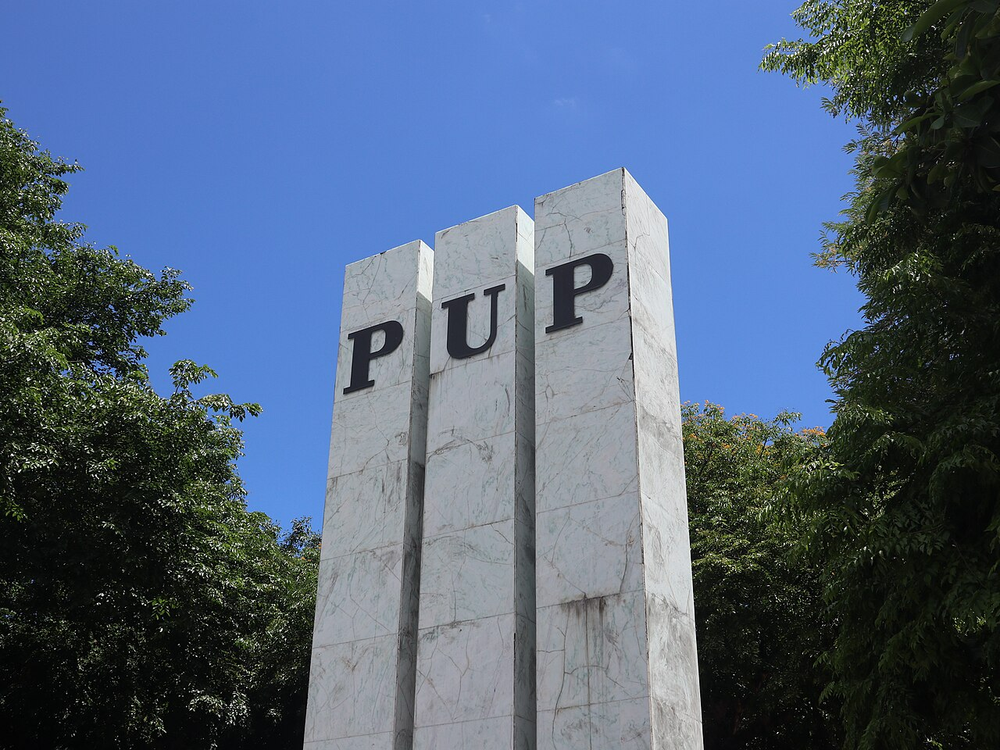
        

                The PUP Pylon is one of the most recognizable architectural symbols of the Polytechnic University of the 
                Philippines, Sta. Mesa. Standing tall near the main gate, it marks the historical entrance to the campus and serves 
                as a lasting emblem of the university’s foundation and ideals.        

        <h3>Significance and Features:</h3>
            <ul>
                <li>The three pillars of the Pylon represent Truth, Excellence, and Wisdom, which are the core values upheld by the university.</li>
                <li>Serves as a monumental gateway, welcoming thousands of students and visitors daily.</li>
                <li>Considered one of the oldest and most iconic landmarks in the A. Mabini Campus.</li>
            </ul>
      

      

        <h3>THE MURAL</h3>
        
        

          The sculpture (Cut and welded brass mural relief, 2.5 x 9.3 meters) was built by national artist Eduardo Castrillo † in 1974.  The theme of the artwork is Consolidated Growth through Education - the role of PUP in the educational development of the youth in preparation for their involvement in nation building.  The mural illustrates the social, economic, industrial, technological, and cultural aspect of life with which man blends himself to develop an environment necessary to the progress of the nation.
        

      

      

        <h3>VISITOR’S LOUNGE</h3>
        
        

          The Polytechnic University of the Philippines (PUP) has a facility officially referred to as a Visitors' Lounge (sometimes called a guest room or a social room) located within the university grounds.         

      

      

        <h3>OPEN COURT</h3>
        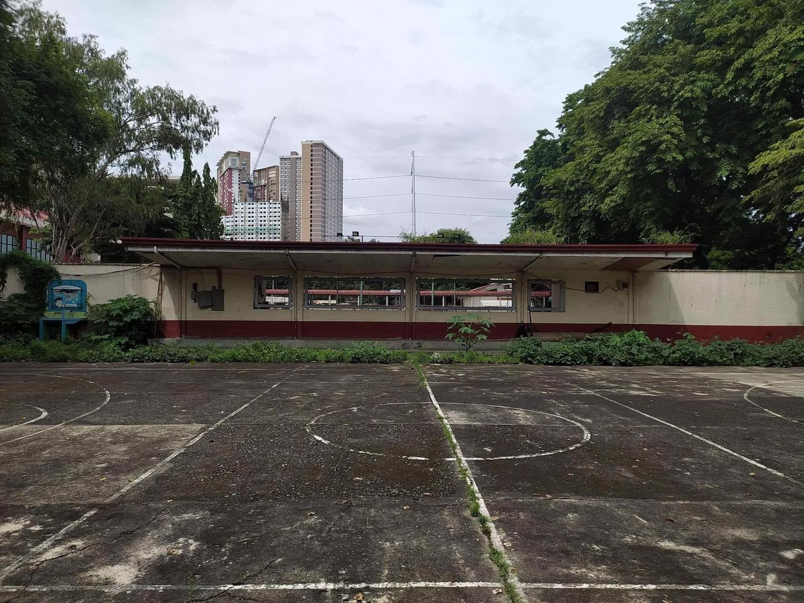
        

          The open court at PUP Main Campus is a multipurpose outdoor space commonly used for various physical, cultural, and recreational activities. The area is accessible to all students and can host large numbers of participants for events such as sports tournaments, student fairs, and organization meetings. Its central location within the campus makes it a popular spot for hanging out or playing informal games, and it is surrounded by key university landmarks like the grandstand, oval, and Freedom Park.
        

      

      

        <h3>LAWN TENNIS COURT</h3>
        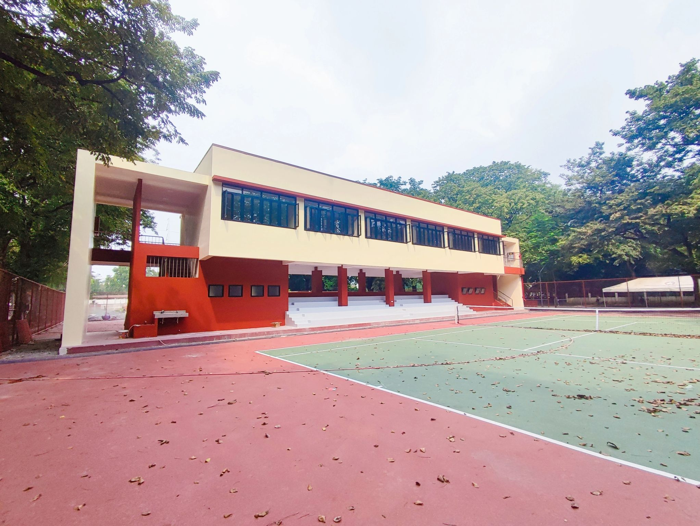
        

          The PUP Tennis Court serves as a hub for both athletic training and 
          recreational play. Renovated with a modern surface and a small bleacher area, 
          it provides students a venue for physical education classes, varsity practices, 
          and friendly matches. Surrounded by trees and located beside the gymnasium, 
          it offers a refreshing and open space that encourages sportsmanship and active campus life.

      

      

        <h3>BASKETBALL COURT</h3>
        
        

          The outdoor court at PUP Main Campus is a large, open area designed for multi-use activities, serving as a primary venue for student gatherings, sports events, and recreational play. When set up for basketball, the same open court is equipped with hoop rings, making it suitable for both organized games and casual shooting. The court is conveniently located within the campus and is accessible to students for a variety of functions, ensuring it remains a lively and well-utilized part of campus life. 
        

      

      

        <h3>SOUVENIR SHOP</h3>
        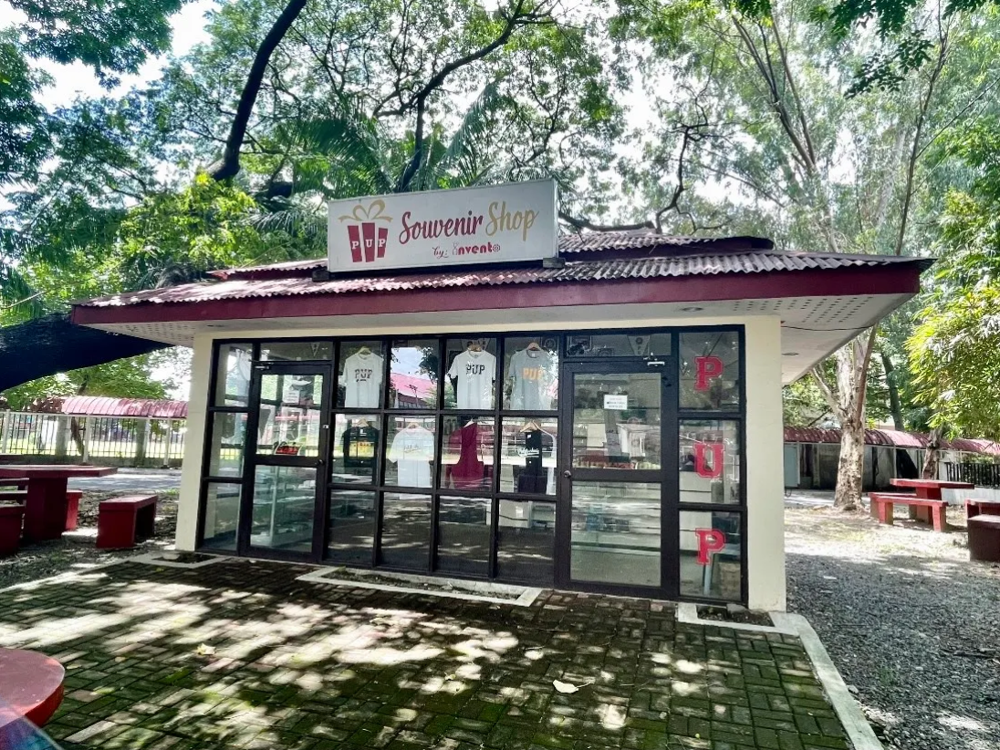
        

          The PUP Souvenir Shop shall be the official and authorized provider of apparel and non-apparel souvenir/novelty items bearing the name of the University and official logo/trademark.        
        

      

      

        <h3>MABINI SHRINE</h3>
        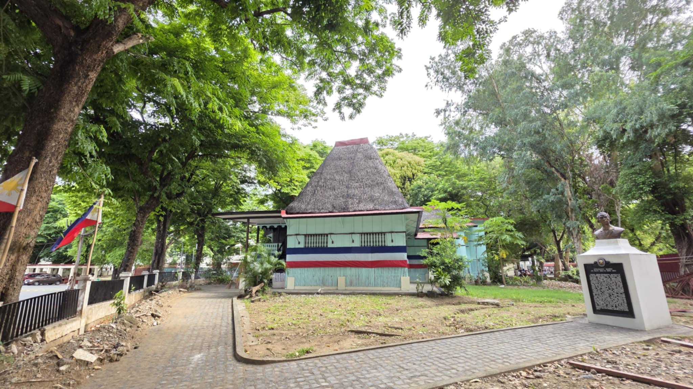
        

                The Mabini Shrine serves as both a historical and cultural centerpiece of 
                the Polytechnic University of the Philippines. It is the preserved 
                ancestral house of Apolinario Mabini, the “Brains of the Revolution” and 
                one of the nation’s greatest heroes. The shrine features personal artifacts, 
                writings, and memorabilia that reflect Mabini’s intellect, patriotism, and simple lifestyle.
        

            <h3>Significance:</h3>
            <ul>
                
 It stands as a symbol of knowledge, integrity, and service — core values that PUP 
                    seeks to cultivate among its students. The shrine also serves as an educational site 
                    where visitors can learn about Mabini’s vital role in shaping 
                    the country’s independence and governance.
                

            </ul>
      

      

        <h3>MABINI MUSEUM</h3>
        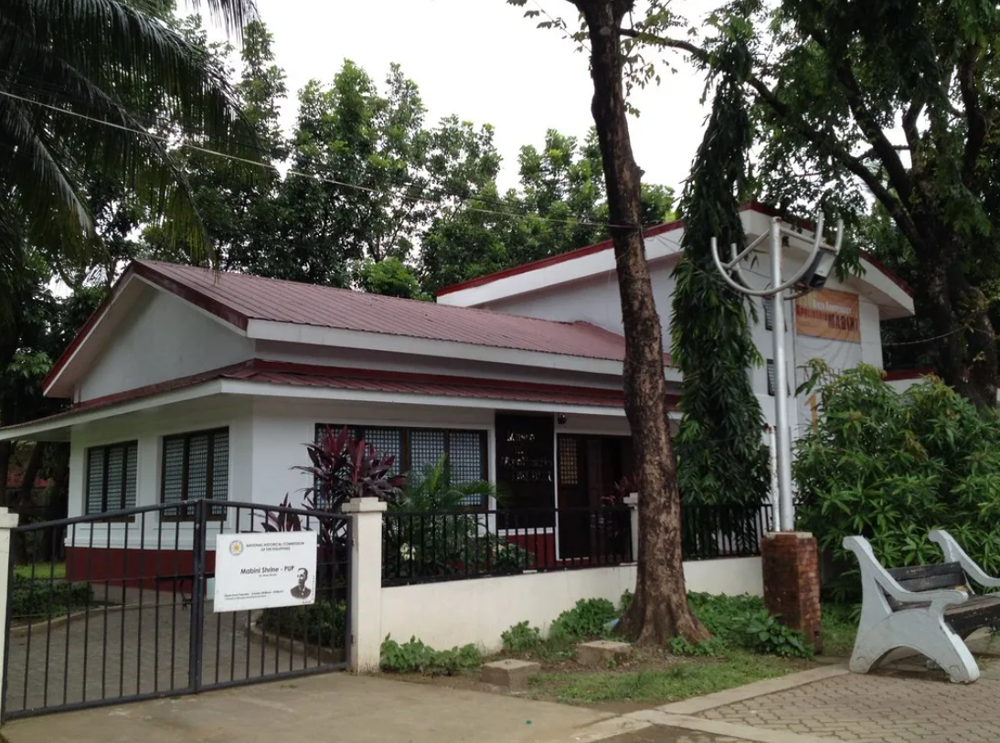
        

          The Mabini Shrine- PUP features the reproduction of the nipa house where Apolinario Mabini used to live during his student years at UST until his death on 13 May 1903. The shrine also features the Museo ni Apolinario Mabini which was inaugurated last 23 July 2013, the 149th Birth Anniversary of Mabini.        

      

      

        <h3>OBELISK</h3>
        
        

                The PUP Obelisk is one of the most iconic landmarks of the Polytechnic University of the Philippines, Sta. Mesa. 
                Located near the main entrance of the campus, the obelisk symbolizes the university’s enduring commitment to truth, 
                excellence, and service to the nation. It serves as a welcoming monument for students and visitors
                entering the A. Mabini Campus.
        

            <h3>Significance and Features:</h3>
            <ul>
                <li>Serves as a symbol of the university’s identity, often featured in official logos, 
                    student events, and graduation photos.</li>
            </ul>
      

      

        <h3>FREEDOM PARK</h3>
        
        

          Nemesio E. Prudente Freedom Park is a park located on the main campus of the Polytechnic University of the Philippines (PUP) in Sta. Mesa, Manila. It serves as a significant open space for students and events, and it is named after Dr. Nemesio E. Prudente, a former president of the university, known for his activism and the many initiatives he implemented. 
        

      

      

        <h3>FOUNTAIN PARK</h3>
        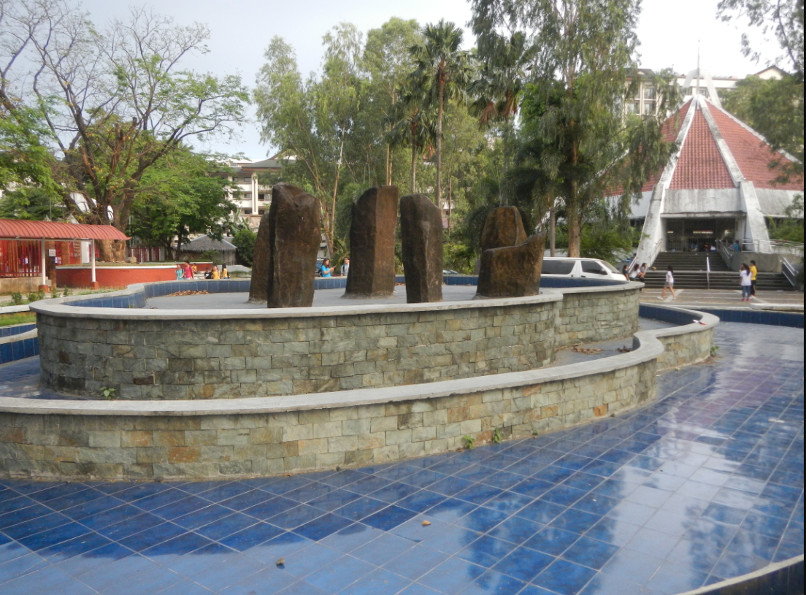
        

          The Polytechnic University of the Philippines (PUP) main campus in Santa Mesa, Manila, features a park space that is officially referred to as Fountain Park, as well as the PUP Lagoon which was recently renovated and serves as another park and open space for students. The campus also includes the larger Freedom Park.         

      

      

        <h3>INTER-FAITH CHAPEL</h3>
        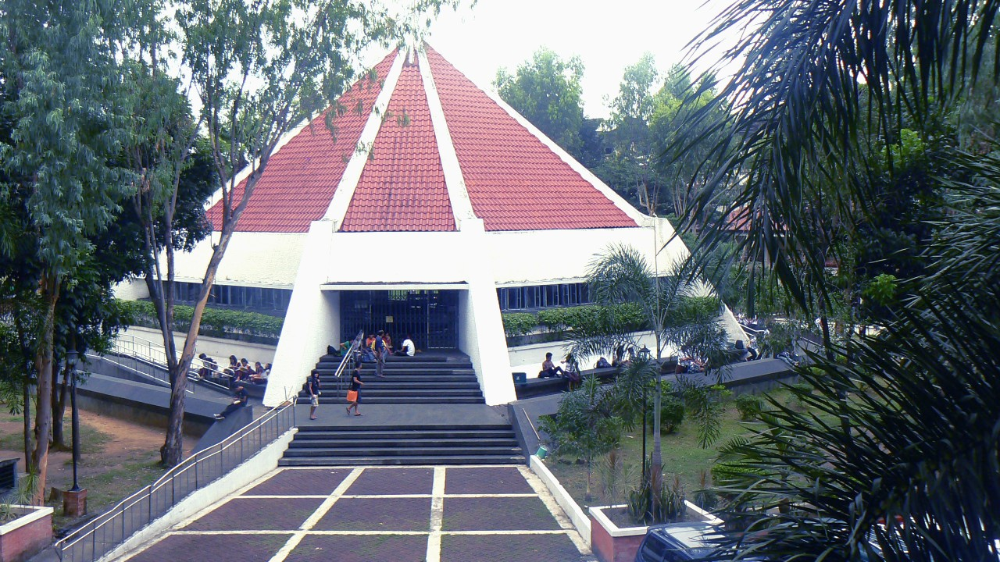
        

                The Inter-Faith Chapel at the PUP A. Mabini Campus is a dedicated ecumenical space 
                designed to honour the diverse religious traditions of the university community. 
                Positioned on the eastern portion of the campus, its architecture features a distinctive 
                rounded form that invites contemplation and spiritual unity. 
        

            <h3>Significance and Features:</h3>
            <ul>
                <li>It offers a serene retreat for students, faculty, and staff—serving as a venue 
                    for reflection, prayer, meditation, multi-faith services, and campus worship activities.</li>
                <li>One notable feature is a “prayer wall” at the entrance where individuals may write
                    wishes or dreams on coloured paper and post them, symbolising hope and community across faiths.</li>
            </ul>

            <h3>Key Notes:</h3>
            <ul>
                <li>The chapel was constructed as part of PUP’s campus expansion in the late 1970s — records indicate that 
                    in 1979 the Inter-Faith Chapel, along with other major campus structures, was completed on the Sta. Mesa site</li>
                <li>While specific floor-area figures are not widely published, the chapel is situated within the 
                    10.71-hectare A. Mabini Campus, which hosts the core academic buildings and services of PUP.</li>
            </ul>
      

      

        <h3>MAIN ACADEMIC BUILDING</h3>
        
        

                The Main Building of the Polytechnic University of the Philippines, Sta. Mesa serves as the heart of the university and the center of its academic and administrative operations. Located along Anonas Street, Sta. Mesa, Manila, this building is recognized as the first academic structure constructed within the university's main campus, also known as the A. Mabini Campus.
        

            

                As one of PUP’s most iconic landmarks, the Main Building symbolizes the university’s long-standing commitment to accessible and quality education for the Filipino people. It houses several vital offices, including the Office of the University Registrar, college departments, and other key administrative units that support both students and faculty.
            

            <h3>Significance and Features:</h3>
            <ul>
                <li>Serves as the administrative and academic hub of the university.</li>
                <li>Considered a historical structure as it was the first major building built in the main campus area.</li>
                <li>Acts as the anchor point of the 10.71-hectare A. Mabini Campus, surrounded by other major facilities such as the Mabini Shrine, Ninoy Aquino Library and Learning Resources Center, and Freedom Park.</li>
            </ul>

            <h3>Key Notes:</h3>
            <ul>
                <li>The A. Mabini Campus covers approximately 10.71 hectares, with the Main Building centrally located for accessibility and orientation.</li>
                <li>Due to the increasing student population and modernization efforts, a new 9-storey academic building is currently being planned to replace or upgrade the existing Main Building structure.</li>
                <li>Remains one of the most visited and photographed landmarks in the university, representing PUP’s history, progress, and identity.</li>
            </ul>
      

      

        <h3>GAZEBO</h3>
        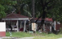
        

          The PUP Main Campus gazebo is located within landscaped open areas, serving as a recreational and resting spot for students and visitors. It is situated near the newly-renovated PUP Lagoon and connects with walking paths and bridges leading to the main academic building. The gazebo provides shaded seating and a peaceful atmosphere, making it a popular place for relaxation, informal meetings, and socializing between classes or campus events. The university has focused on upgrading the park and its gazebos to improve open spaces and create a more welcoming campus environment.
        

      

      

        <h3>GRANDSTAND</h3>
        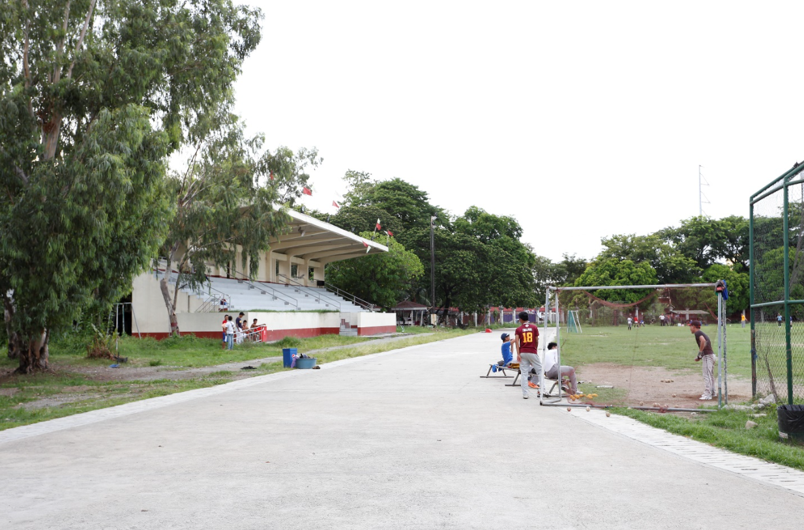
        

          The PUP Grandstand is a prominent outdoor facility located within the main campus at Sta. Mesa, Manila, positioned alongside the university’s sports oval and open fields. It provides tiered seating for spectators during major athletic events, ceremonies, graduations, and other school gatherings, hosting both formal and recreational activities throughout the academic year. The grandstand is directly accessible from other key campus landmarks such as Freedom Park, the open courts, and the main academic buildings, making it a central venue for large student assemblies and celebrations. Its design supports a spacious viewing area, allowing students, faculty, and guests to comfortably watch sports or participate in campus festivities.
        

      

      

        <h3>OVAL</h3>
        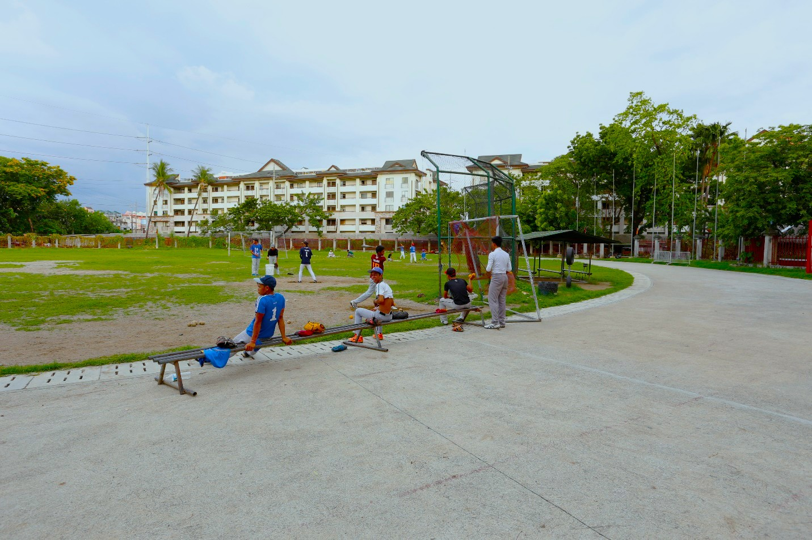
        

          The PUP Oval at the Main Campus in Sta. Mesa is a prominent outdoor sports facility designed as a multi-use track and field area. It is located beside key landmarks like the grandstand, open courts, and Freedom Park, forming the central hub for athletics, physical education classes, intramural competitions, and major university events. The oval accommodates various activities such as running, jogging, and track sports, and its spacious layout is ideal for both formal sporting events and informal fitness routines for students and staff. This space helps to foster campus life and supports the university’s commitment to health, wellness, and athletic excellence.
        

      

      

        <h3>TAHANAN NG ATLETA</h3>
        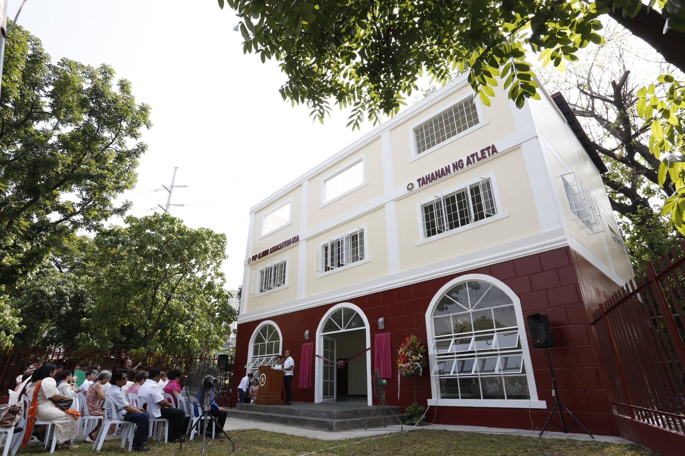
        

          PUP’s “Tahanan ng Atleta” refers to the designated dormitory or living quarters built to house the university’s student-athletes. This facility is created to provide a supportive and convenient environment for athletes who need accommodations close to the sports complex, training grounds, and academic buildings. The structure, designed with a modern style, aims to help student-athletes balance their training and studies by offering comfortable lodging, basic amenities, and proximity to essential campus facilities. It stands as part of the university’s efforts to promote athletic excellence and well-being within the campus community.
        

      

      

        <h3>GABRIELA SILANG BUILDING</h3>
        
        

          Lorem ipsum dolor sit amet, consectetur adipiscing elit, sed do eiusmod tempor incididunt ut labore et dolore magna aliqua. Ut enim ad minim veniam, quis nostrud exercitation ullamco laboris nisi ut aliquip ex ea commodo consequat.
        

      

      

        <h3>FOOD AND NUTRITION BUILDING</h3>
        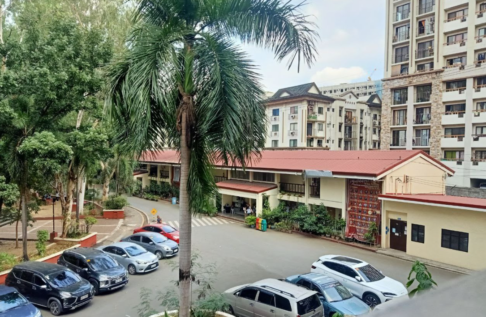
        

          The PUP Food and Nutrition Building, officially known as the Nutrition and Food Science Building, is located on Anonas Street within the PUP Main Campus in Sta. Mesa, Manila. This building serves as the home for the College of Nutrition and Food Science and provides classrooms, laboratories, and offices to support academic programs such as Nutrition and Dietetics, and Food Technology. Its strategic location near other key facilities ensures that students have convenient access to the necessary resources for both lecture and practical hands-on learning. The building is a vital center for education and research in nutrition, dietetics, and food science at PUP.
        

      

      

        <h3>SAMPAGUITA BUILDING</h3>
        
        

          The PUP Sampaguita Building is a well-known facility located near the Linear Park on the A. Mabini Campus of the Polytechnic University of the Philippines. It is commonly referred to as the university canteen or student center, where students can purchase cooked dishes and other food items. The building serves as a popular dining area and social gathering spot for students, providing an accessible and convenient place for meals within the main campus. It is a key part of campus life, offering a wide range of affordable food options to support the daily needs of the student body.
        

      

      

        <h3>STUDENT CENTER</h3>
        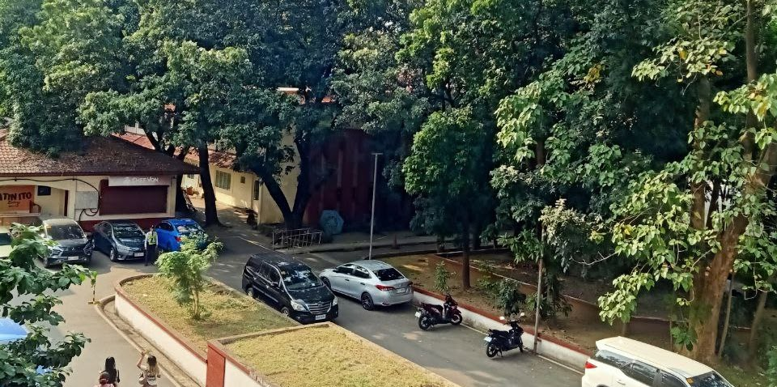
        

          The PUP Student Center is a distinct facility from the Charlie Del Rosario Student Development Center in the Sta. Mesa Main Campus. Based on campus maps and facility lists, the Student Center is a separate building, typically designated for student affairs, organization headquarters, meeting halls, and social spaces. 
        

      

      

        <h3>CHARLIE DEL ROSARIO BUILDING</h3>
        
        

          The PUP Charlie Del Rosario Student Development Center is a dedicated building located within the A. Mabini Campus in Sta. Mesa, Manila. It houses essential student services, including the Office of Student Services, guidance and counseling, and is a main venue for accredited student organizations, cultural groups, and student publications. The building is often used for student meetings, welfare activities, and hosts important university events focused on student development and support.
        

      

      

        <h3>LINEAR PARK</h3>
        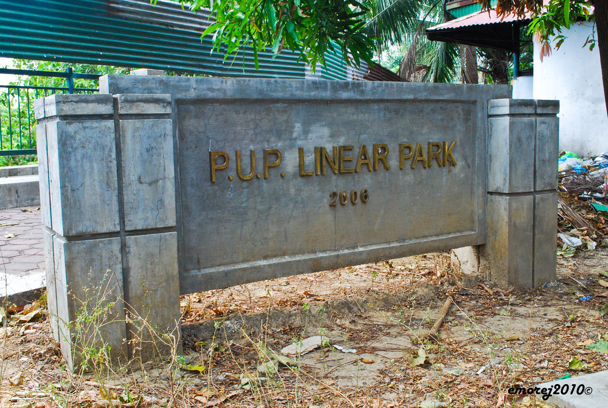
        

          PUP Linear Park is a scenic, landscaped walkway located on the banks of the Pasig River, running along the A. Mabini Campus of the Polytechnic University of the Philippines in Sta. Mesa, Manila. Created in 2006, the park serves as a green promenade for walking, relaxing, and socializing, offering benches, shaded paths, and views of the river. The park is a favorite spot for students and visitors seeking a quiet escape within the campus, connecting nearby landmarks such as the Sampaguita Building and other campus facilities. Its design helps promote environmental awareness and community involvement alongside the bustling city environment.
        

      

      

        <h3>LABORATORY HIGH SCHOOL BUILDING</h3>
        
        

          The PUP Laboratory High School Building is located within the Mabini Campus of the Polytechnic University of the Philippines in Sta. Mesa, Manila. The building complex is composed of several structures that house multiple lecture rooms, laboratories, a multi-purpose hall, and offices to support high school education—a unique setup as it functions as the laboratory school of the PUP College of Education. It was established in 1954, and its modern facilities support a commercial curriculum, along with general, social, physical, and biological science courses, providing hands-on teaching experience for education students and high-quality secondary education for students. 
        

      

      

        <h3>PRINTING PRESS BUILDING</h3>
        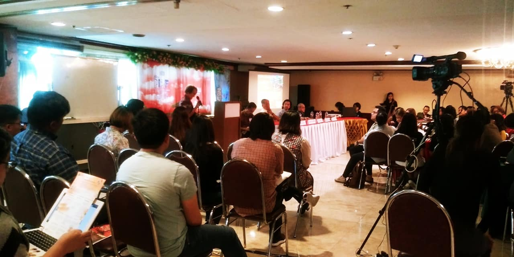
        

          The PUP Printing Press Building is a key facility located within the A. Mabini Campus of the Polytechnic University of the Philippines in Sta. Mesa, Manila. This building houses the university’s printing press operations, including pre-press, digital printing, and administrative printing services, which support the production of academic publications, student materials, and university communications. It is equipped with modern printing technologies to ensure quality output for various university departments and projects. The Printing Press Building plays a vital role in the university's academic and administrative functions by providing essential printing and publishing resources on campus.
        

      

      

        <h3>PROPERTY AND SUPPLY MANAGEMENT OFFICE</h3>
        
        

          The PUP Property and Supply Management Office (PSMO) is a vital administrative unit located within the Main Campus in Sta. Mesa, Manila. This office is responsible for the procurement, receipt, safekeeping, issuance, and inventory management of supplies, materials, equipment, and property across the university. It ensures that all university resources and assets are efficiently managed and distributed to support the needs of students, faculty, and administration, maintaining accountability and transparency in handling government property. The office plays a crucial role in enabling smooth campus operations and the maintenance of academic and support facilities.
        

      

      

        <h3>WATER TOWER</h3>
        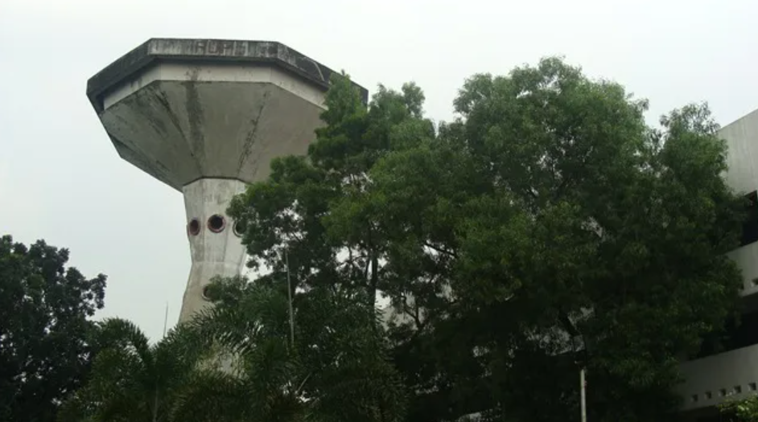
        

          The PUP Water Tower is a landmark utility structure found within the A. Mabini Campus of the Polytechnic University of the Philippines in Sta. Mesa, Manila. It is located near the Ninoy Aquino Learning Resource Center and the Laboratory High School, serving as the main water storage and supply facility for the campus. The structure stands out due to its height and distinctive design, making it easily recognizable among students and staff. While functional, the water tower is also noted as a part of the campus landscape and is referenced as a memorable spot by PUP alumni.
        

      

      

        <h3>NINOY AQUINO LEARNING RESOURCE CENTER</h3>
        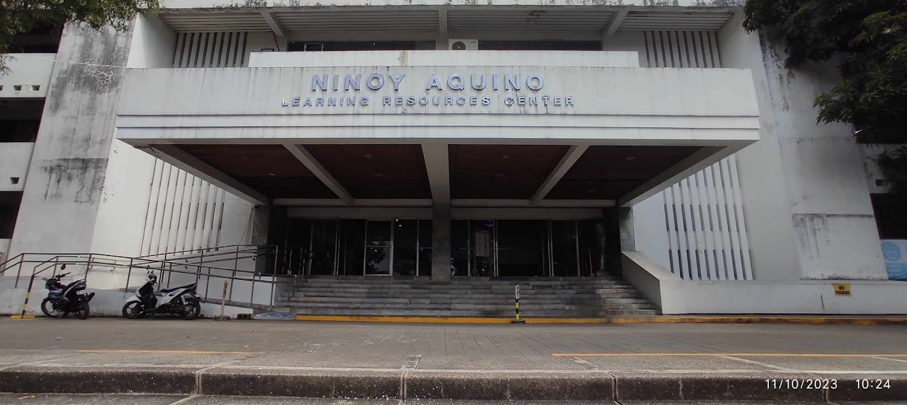
       

                The Ninoy Aquino Library and Learning Resource Center (NALLRC), commonly known as the PUP Main Library, 
                is the central information and research facility of the Polytechnic University of the Philippines, Sta. Mesa. 
                Named in honor of Senator Benigno “Ninoy” Aquino Jr., the building serves as a symbol of knowledge, freedom, 
                and continuous learning within the university.
       

            <h3>Significance and Features:</h3>
            <ul>
                <li>Houses a vast collection of books, journals, theses, digital archives, and multimedia resources across various disciplines.
                <li>Provides study areas, computer sections, and discussion rooms, promoting both individual and collaborative learning.</li>
            </ul>
      

      

        <h3>LAGOON COMMERCIAL SPACES</h3>
        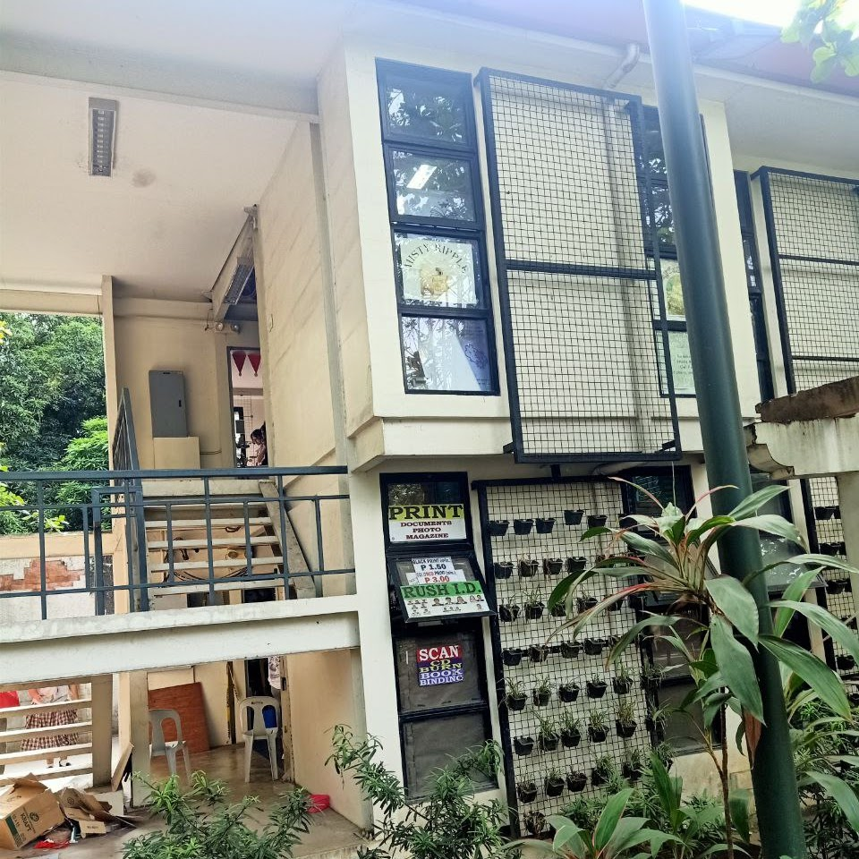
        

          These are business and service establishments located near the Lagoon Park, designed to support students and visitors with convenience stores, food stalls, and retail spaces. The commercial spaces serve as a popular stop for quick meals and affordable goods during campus breaks or events. They provide additional amenities that help make the Lagoon area a vibrant hub for campus life.
        

      

      

        <h3>AMPHITHEATER</h3>
        
        

          The PUP Amphitheater is an open-air performance venue situated adjacent to the Lagoon Park. It features terraced seating and a stage used for cultural programs, student presentations, concerts, and large gatherings. Its location makes it an accessible and practical space for creative and community activities, fostering engagement among the PUP community.
        

      

      

        <h3>LAGOON PARK</h3>
        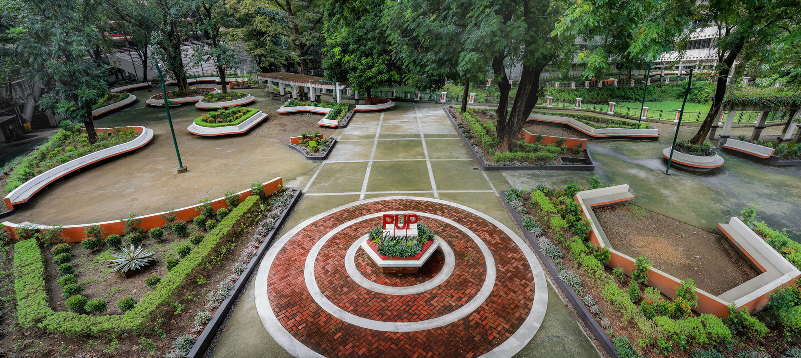
         

                The PUP Lagoon, located at the center of the A. Mabini Campus in Sta. Mesa, is one 
                of the most vibrant and well-loved spots in the Polytechnic University of the Philippines. 
                Surrounded by greenery and shaded areas, it serves as both a relaxation area and a student 
                marketplace, making it a favorite destination for PUPians throughout the day.
         

            <h3>Significance and Features:</h3>
            <ul>
                <li>Known as a social and recreational hub, the Lagoon is where many students gather to 
                    study, chat, buy foods or drinks, or take a break from classes.</li>
                <li>It’s also a mini marketplace, where most food stalls and small vendors can be found—selling 
                    affordable snacks, meals, and drinks for students.</li>
                <li>Beyond food, the Lagoon area is also where students can buy academic needs such as folders, 
                    papers, and printing services, as well as souvenirs and handmade accessories like keychains 
                    and crafts made by fellow PUPians.</li>
            </ul>
      

      

        <h3>NUTRITION & FOOD TECHNOLOGY RESEARCH AND DEVELOPMENT CENTER BUILDING</h3>
        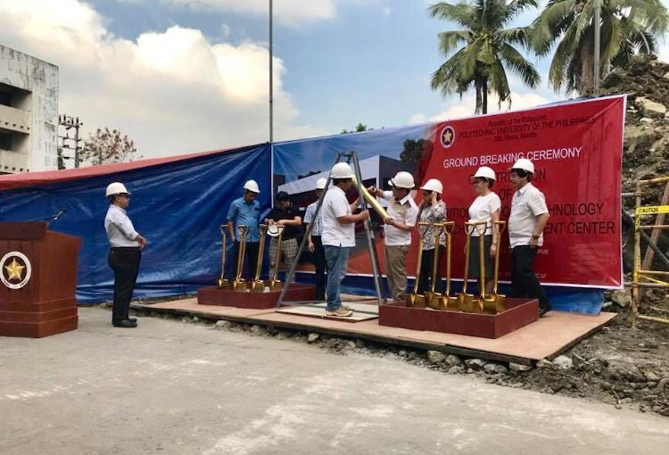
        

          This facility supports advanced research and development activities related to nutrition, food technology, and dietetics, providing laboratories and equipment dedicated to scientific studies and innovation in food sciences. It is closely linked with the College of Nutrition and Food Science, facilitating hands-on research projects, product development, and technical training for students and faculty. The building plays a significant role in fostering academic excellence and industry collaboration in nutrition and food technology at PUP.
        

      

      

        <h3>HUMAN KINETICS BUILDING</h3>
        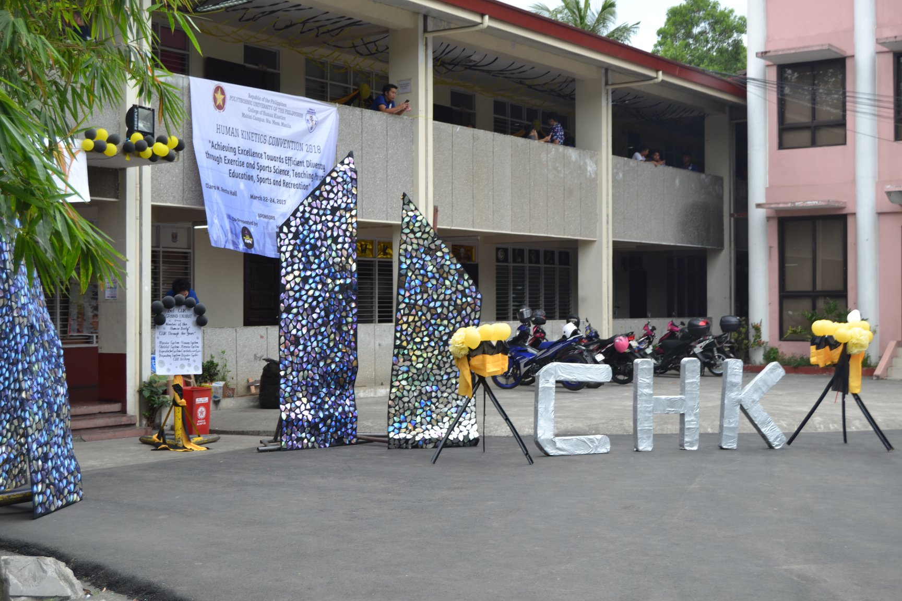
        

          The PUP Human Kinetics Building is home to the College of Human Kinetics (CHK) at the Polytechnic University of the Philippines, Sta. Mesa, Manila. This building, sometimes identified as the Physical Education Building, is equipped with administrative offices, faculty rooms, lecture halls, and specialized spaces for sports, wellness, and fitness training. It supports academic programs in physical education, sports science, and wellness, and serves as the hub for student-athletes, varsity teams, and physical education classes. Its facilities foster holistic development through sports and promote physical health among the PUP community.
        

      

      

        <h3>TAHANAN NG ALUMNI</h3>
        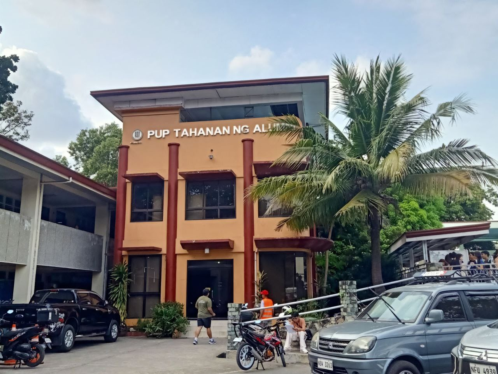
        

          The Tahanan ng Alumni, or Alumni Home, is a building dedicated to serving graduates of PUP. It acts as a local headquarters for alumni affairs, events, and networking activities. This facility offers spaces for gatherings, outreach initiatives, and supports alumni engagement with campus programs, maintaining a strong connection between past and present students.
        

      

      

        <h3>SWIMMING POOL</h3>
        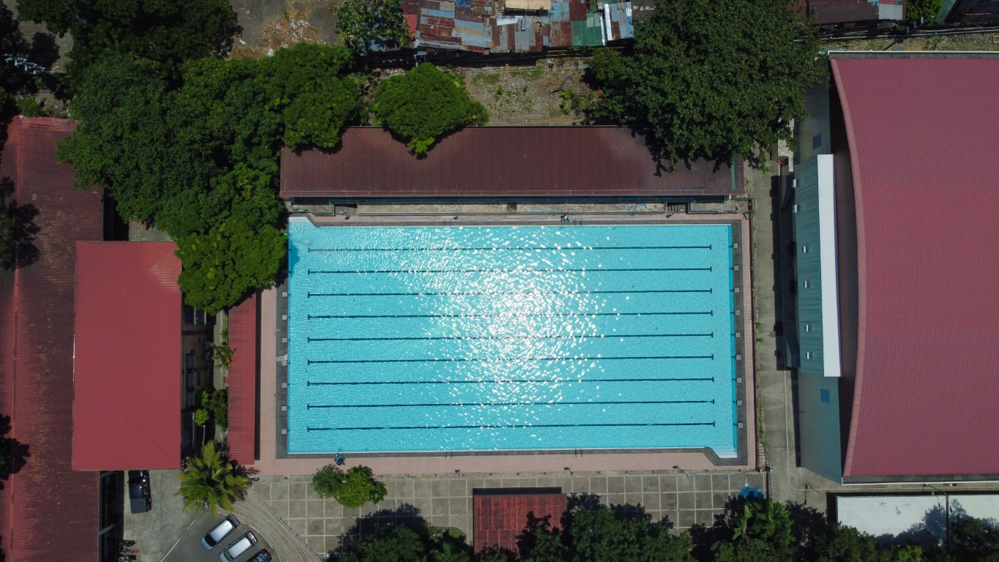
            

                The PUP Swimming Pool is a sports facility that promotes physical fitness, recreation, 
                and athletic training. It serves as a venue for swimming classes, varsity practices, 
                and various university-wide events related to sports and wellness.
            

            <h3>Significance and Features:</h3>
            <ul>
                <li>Used primarily by the PUP Physical Education Department and the 
                    university’s swimming varsity team.</li>
                <li>Occasionally opened for university events, 
                    sports fests, and inter-department competitions.</li>
            </ul>
      

      

        <h3>MULTI-PURPOSE BUILDING</h3>
        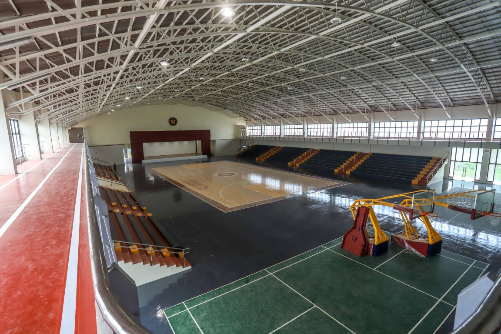
            

                The PUP Gymnasium is a multi-purpose facility. It serves as the center for sports, 
                assemblies, and large university events, reflecting PUP’s commitment to promoting 
                not only academic excellence but also physical development and community engagement among students.
            

            <h3>Significance and Features:</h3>
            <ul>
                <li>Venue for major activities such as intramurals, sports competitions, 
                    general assemblies, graduation rehearsals, and cultural events.</li>
                <li>Equipped with basketball courts, bleachers, stage areas, and sound systems, 
                    accommodating both athletic and social functions.</li>
                <li>Acts as a safe space for physical fitness and camaraderie, 
                    fostering teamwork and discipline.</li>
            </ul>
      

      

        <h3>ENGINEERING AND SCIENCE RESEARCH CENTER</h3>
        
            

                The Engineering and Science Research Center (ESRC) is one of the key academic and research facilities. 
                It serves as a hub for innovation, experimentation, and applied research in 
                the fields of engineering, science, and technology. The building supports PUP’s mission 
                to strengthen scientific advancement and foster a culture of innovation among students and faculty.
            

            <h3>Significance and Features:</h3>
            <ul>
                <li>Houses laboratories, research rooms, and technical facilities used by students from 
                    the College of Engineering and College of Science.</li>
                <li>Plays a crucial role in enhancing STEM education and practical 
                    research exposure for PUPians.</li>
                <li>Provides spaces for capstone projects, prototype development,
                    and applied research activities.</li>
            </ul>
      

      

        <h3>COMMUNICATION BUILDING</h3>
        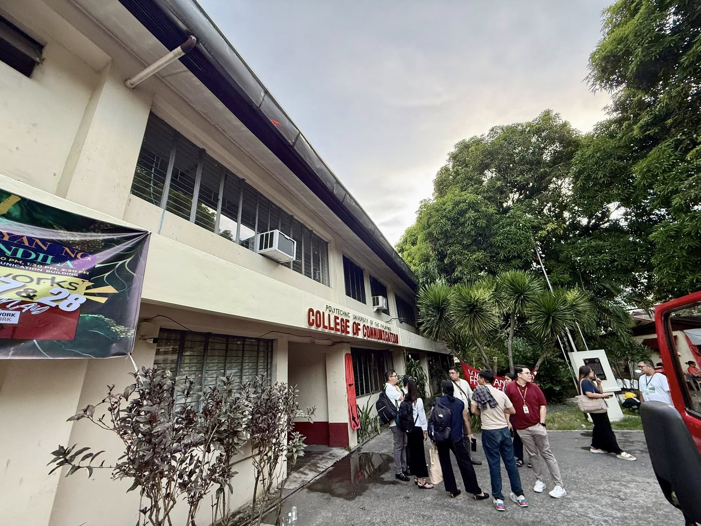
         

                The College of Communication (COC) is the home of aspiring media practitioners 
                and creative communicators at the Polytechnic University of the Philippines. 
                It is known for producing graduates who excel in journalism, broadcasting, 
                public relations, advertising, and communication research — recognized both 
                locally and internationally.
            

            <h3>Significance and Features:</h3>
            <ul>
                <li>Houses state-of-the-art broadcasting studios, editing rooms, and production 
                    areas for practical learning.</li>
                <li>Formerly part of the College of Languages and Mass Communication before 
                    becoming an independent college.</li>
            </ul>
      

      

        <h3>PUP THEATER</h3>
        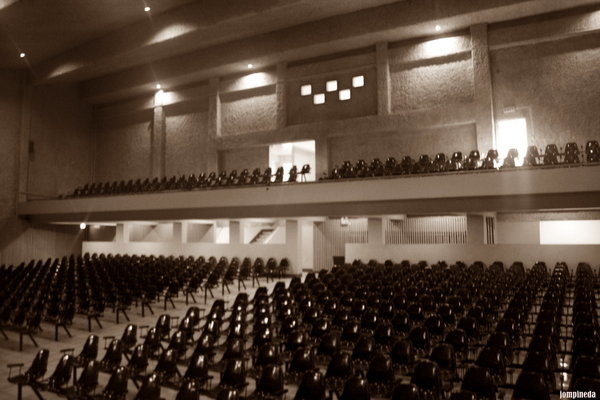
        

          The PUP Theater is designed for cultural performances, stage productions, seminars, and academic events. It features tiered seating and a stage, providing a venue for student organizations, academic units, and invited groups to showcase the performing arts and special programs. The theater supports the creative life of the campus.
        

      

      

        <h3>ENGINEERING AND ARCHITECTURE BUILDING</h3>
        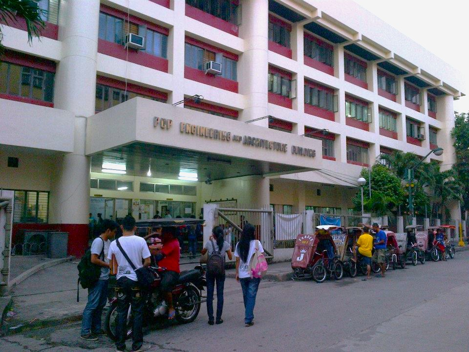
            

                The College of Engineering and Architecture (CEA) is one of the largest and most 
                dynamic colleges in the Polytechnic University of the Philippines. 
                It serves as the academic hub for students pursuing degrees in civil, 
                electrical, industrial, computer, and mechanical engineering, as well as architecture.
            

            <h3>Significance and Features:</h3>
            <ul>
                <li>Houses specialized laboratories, drafting rooms, and computer facilities for 
                    engineering and architectural design.</li>
                <li>One of the oldest and most respected colleges in PUP, with thousands of 
                    alumni serving in government and private industries..</li>
            </ul>
      

      

        <h3>CONDOTEL</h3>
        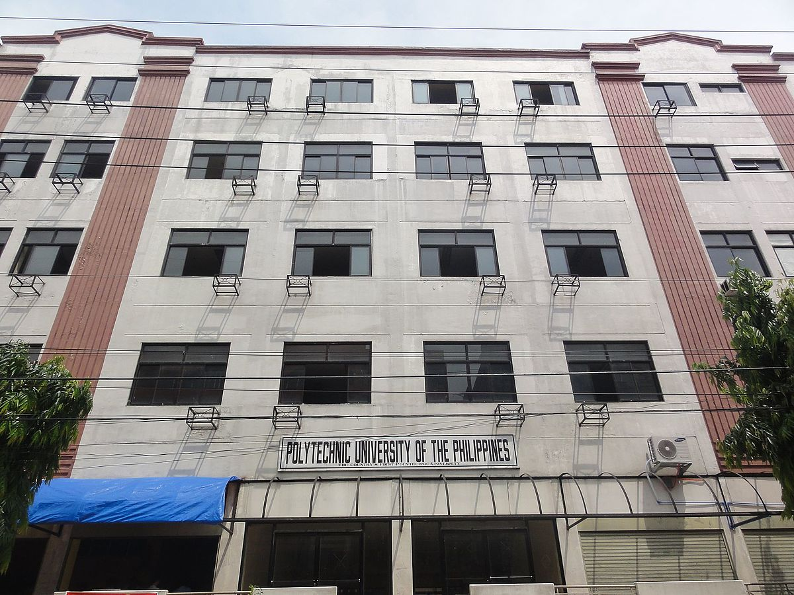
        

          The PUP Condotel serves as a training facility for hospitality and tourism students, offering rooms for practical exercises in hotel and dormitory management. It also provides accommodation for guests, visiting faculty, and event participants, and simulates a real-world hospitality environment for hands-on learning.
        

      

      

        <h3>NDC TENNIS COURT AND CLUB HOUSE</h3>
        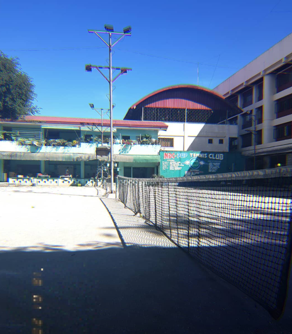
        

          This is a sports area featuring outdoor tennis courts and a clubhouse facility for athletes. It is used for varsity training, tournaments, and student recreation, and provides spaces for gatherings, meetings, and sports instruction linked to the tennis program.
        

      

      

        <h3>NDC COVERED COURT</h3>
        
        

          The NDC Covered Court is a sheltered sports venue used mainly for basketball and indoor games, varsity practices, and student tournaments. It offers bleacher seating and locker facilities and supports large group activities, training sessions, and multi-sport campus events.
        

      

      

        <h3>BUSINESS PROCESSING OFFICE</h3>
        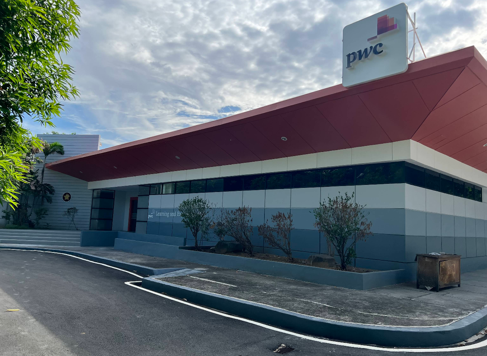
        

                The PwC Learning and Experience Hub, formerly known as the Business Processing Office, serves as a 
                modern training and innovation center within the Polytechnic University of the Philippines.
                The facility was established in partnership with PricewaterhouseCoopers (PwC) 
                to provide industry-based learning experiences for students.
            

            <h3>Significance and Features:</h3>
            <ul>
                <li>Hosts seminars, workshops, and industry talks led by PwC professionals.</li>
                <li>Focused on business process innovation, technology, and experiential learning.</li>
            </ul>
      

      

        <h3>INFORMATION TECHNOLOGY BUILDING</h3>
        
            

                The PUP Institute of Technology (iTech) is one of the specialized academic units of the Polytechnic University of the Philippines, 
                focused on providing industry-aligned technical education. 
                It offers programs that integrate practical skills and applied sciences to 
                prepare students for careers in engineering technology, computer studies, and 
                industrial innovation.
            

            <h3>Significance and Features:</h3>
            <ul>
                <li>Offers programs emphasizing engineering technology, electronics, 
                    and industrial systems.</li>
                <li>Recognized for its practical and application-based learning approach.</li>
            </ul>
      

      

        <h3>ANTIQUE HOUSE</h3>
        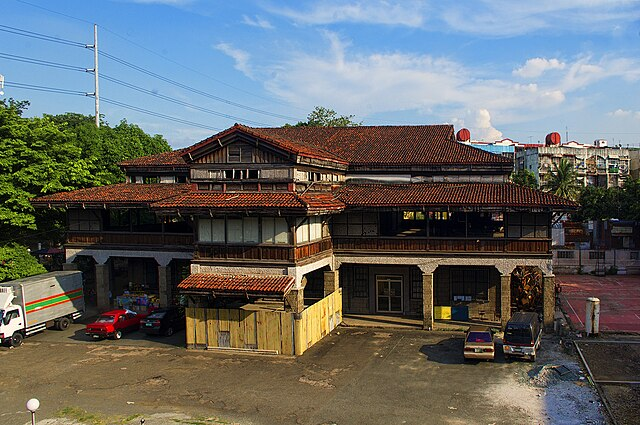
        

          The PUP Antique House, located on campus, is home to university heritage treasures and memorabilia. It serves both as a museum and a venue for events related to culture, history, and alumni gatherings.
        

      

      

        <h3>GRADUATE SCHOOL</h3>
        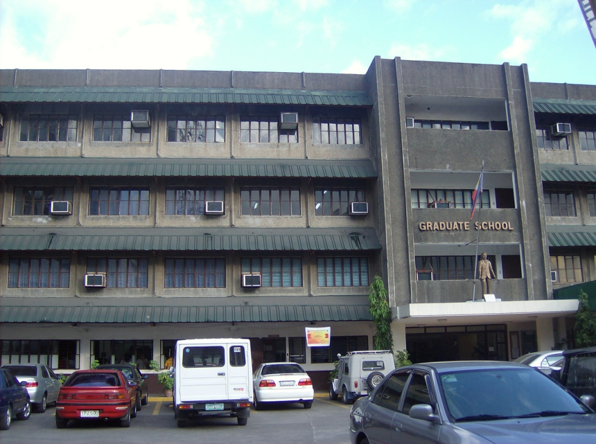
        

          The PUP M. H. Del Pilar Campus, named after Marcelo H. Del Pilar, is one of three main sub-campuses of PUP in Sta. Mesa, Manila. It serves as the home of the Graduate School and the College of Tourism, Hospitality, and Transportation Management (CTHTM). A key facility is the Hasmin Hostel, which provides sleeping and residential quarters for students and faculty. Purchased in the late 1980s, the hostel formerly operated as a budget lodging and now supports student housing and practical training for CTHTM students, serving as a simulated training ground for hospitality management. The campus offers modern facilities to support advanced learning and practice-oriented programs, overseen by Director Joseph M. Lardizabal.
        

      

      

        <h3>HASMIN BUILDING</h3>
        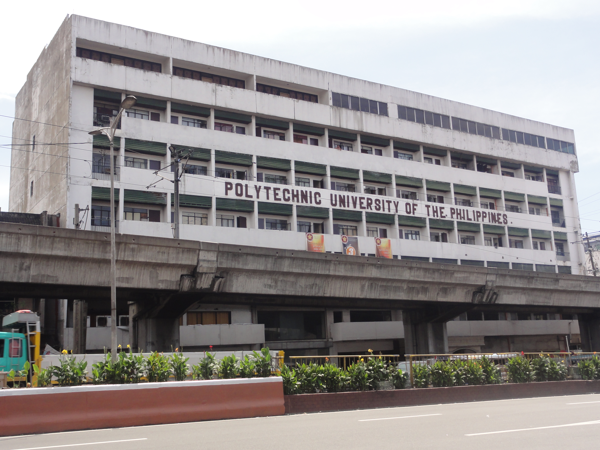
            

                The Hasmin Building, also known as the Graduate School Building, serves as the 
                home of the Polytechnic University of the Philippines Graduate School (PUP GS). 
                It is one of the most prominent and modern structures on campus, symbolizing PUP’s 
                commitment to advanced studies and professional growth.
            

            <h3>Significance and Features:</h3>
            <ul>
                <li>Often used for academic seminars, thesis defenses, and professional training</li>
                <li>“Hasmin” is short for “Hangarin ng Agham, Sining, at Manilayuan”, reflecting PUP’s 
                    values of science, arts, and humanity.</li>
            </ul>
      

    

     

        <h1 id="title">PUP Interactive Map</h1>
        
Morante,C J Heart L. BSIT 3-4

    

  </body>

</html>
